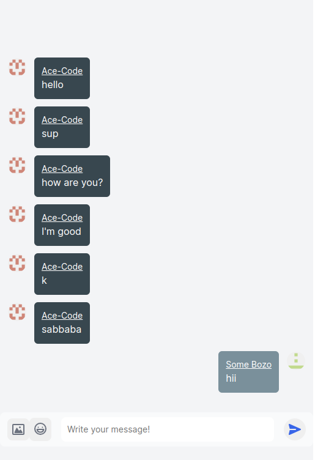

# Realtime Chat with Next.js and Supabase

This is a realtime chat application built using Next.js for the frontend and Supabase for the backend. Users can authenticate using their GitHub accounts and engage in real-time chat conversations.



## Features

- GitHub authentication for user login
- Realtime chat functionality using Supabase's real-time database and pub/sub
- User avatars, timestamps, and message indicators
- Responsive design for various screen sizes

## Technologies Used

- Next.js: A React framework for building server-rendered and static web applications.
- Supabase: An open-source platform for creating backend services, including authentication and real-time database features.

## Getting Started

1. Clone this repository: `git clone https://github.com/Mego-Program/Chat
2. Navigate to the project directory: `cd chat`
3. Install dependencies: `pnpm install`
4. Set up environment variables:

   - Create a `.env.local` file in the project root.
   - Add your Supabase API URL and public API key:

     ```
     NEXT_PUBLIC_SUPABASE_URL=your-supabase-api-url
     NEXT_PUBLIC_SUPABASE_KEY=your-supabase-public-api-key
     SUPABASE_URL=your-supabase-api-url
     SUPABASE_KEY=your-supabase-public-api-key
     ```

5. Run the application: `pnpm run dev`
6. Open your browser and go to `http://localhost:3000` to access the app.

## Deploying the App

1. Sign up for hosting platforms:

   - For Next.js: Consider using Vercel, Netlify, or your preferred hosting service.
   - For Supabase: Deploy your PostgreSQL database on Supabase Cloud or your own infrastructure.

2. Configure environment variables:

   - Set the appropriate environment variables for your hosting platform to match those in `.env.local`.

3. Deploy the frontend and backend:
   - Deploy your Next.js application and ensure it's accessible online.
   - Configure Supabase settings for your deployed app.

## Contributing

Contributions are welcome! If you find any issues or want to enhance the application, please submit a pull request.

## License

This project is licensed under the MIT License. Feel free to modify and use it according to your needs.

---

**Note:** This README is a template. Modify it as needed to match your project's specifics.
